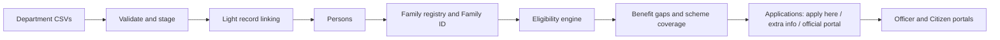

# Kutumb Setu

**A unified, family-centred beneficiary management platform** (hackathon prototype).

> **Live demo:** https://kutumb-setu.vercel.app/citizen/dashboard
> *(No login needed. Just click a role.)*

> ⚠️ **Prototype notice:** all data is **synthetic**. This is not an official Government of Gujarat service and is not connected to UIDAI or any real government system. Scheme names, eligibility thresholds, and portal links are illustrative placeholders.

---

## Problem statement

*"Introduction of Family ID in Gujarat to improve beneficiary management for various government schemes."*

Today every department (health, education, food, labour, housing) keeps its own beneficiary list. The same family appears in many lists, spelled differently, with different addresses and incomes. The result:

- Eligible families are **missed** because no one sees the whole family.
- The same benefit can be **claimed twice** through different departments.
- Officers cannot easily answer: *who is enrolled, who is eligible but missing out, who needs renewal?*
- Citizens must re-enter the same details for every scheme.

## Our solution

The **Family ID** is the backbone: one verified record per household that links every member and every scheme they use.



**What it does**

- **Consolidates** fragmented department records into persons and families, without ever altering the original source records.
- **Assigns a Family ID** (`FAM-GJ-######`) at household level.
- **Evaluates scheme eligibility** with explainable reasons, for both family-level and individual-level schemes.
- **Finds benefit gaps**: families or members who are *eligible but not enrolled*.
- **Routes applications correctly**: some schemes can be applied for inside the platform, some need extra information first, and some belong on another official portal.
- **Prevents duplicate benefits**: one family, one benefit.
- Gives **officers** a coverage and renewal view, and **citizens** a single place to see everything their family receives.

---

## How to use the demo (no login page)

There is **no login page and no password**. This is a prototype, so authentication is replaced by a **demo session**.

1. Open the site's home page.
2. Click one of the three **"Enter demo as…"** cards:
   - **Citizen** (signs you in as *Rameshbhai Patel*, head of the demo family)
   - **Officer**
   - **Admin**
3. You are taken straight to that role's dashboard. Your role is remembered in your browser (local storage), and route guards keep each role to its own pages.
4. To switch roles, use the **role switcher / demo-session indicator** in the app header, or return to the home page and click another card.

> If you open a role page directly and land back on the home page, just pick a role there.

> **Shared demo database:** everyone using the live demo shares one database. If the data looks changed, go to **Admin → Data Ingestion** and use **Reset demo data**, then **Load demo dataset**, to return to the clean starting state.

### Suggested demo walkthrough (~5 minutes)

Follow this flow to see the whole story, using the hero **Patel family** (Kalol, Gandhinagar).

**1. Admin: bring the data in**
- Go to **Data Ingestion**. Click **Reset demo data**, then **Load demo dataset**. This runs five synthetic department CSVs (Health, Education, Food & Civil Supplies, Labour, Housing) through the real pipeline.
- Read the result summary: rows imported, rows with errors, records linked, cases needing review.

**2. Officer: resolve the one ambiguous case**
- Go to **Identity Review**. "Ramesh P Patel" (Food records, older address) looks like "Rameshbhai Patel" but the address differs, so the system **does not merge it automatically**.
- Review the reasons and the source records side by side, then **Approve**.

**3. Officer: see the family**
- Go to **Families** and open the Patel family. It now has a **Family ID**, members with relationships, and the **benefit matrix** (members × schemes: Enrolled / Gap / In progress / Not eligible).
- Note the original spellings from each department are preserved for provenance.

**4. Officer: find who is missing out**
- **Benefit Gaps** lists eligible-but-not-enrolled cases (e.g. Rahul's education assistance, the family's health cover). Try **Initiate outreach** (mock).
- **Scheme Coverage** shows enrolled vs gaps per scheme, coverage %, and renewals due.
- The **Dashboard** summarizes families, persons, beneficiaries, pending applications, and gaps.

**5. Citizen: discover and apply**
- Switch to **Citizen**. The dashboard shows the Family ID prominently, and **Benefits** has two tabs: **Family schemes** and **Individual schemes** (by member). Each scheme shows an eligibility badge and a route chip:
  - **Application Available Here** → e.g. *Student Education Assistance* for Rahul: a pre-filled, read-only form plus consent.
  - **Additional Information Required** → e.g. *Girl Child Support* for Priya: the missing items are listed (bank account last 4 digits, birth certificate); add them and submit.
  - **Apply on Official Portal** → e.g. *Housing Assistance*: see why the family may be eligible, the required documents, and a link to the (placeholder) official portal.

**6. Officer: process the application**
- Switch to **Officer → Applications**. Move Rahul's application to *Under Verification*, then *Approved*, and mark the **benefit delivered**.

**7. Citizen: see the result**
- Back in **Citizen → Applications**, the timeline shows the updated status, and the family's benefit matrix now shows **Enrolled**.
- Try applying again: it is **blocked** with *"Already enrolled"* (duplicate-benefit prevention).

---

## Features by role

**Citizen**
- Family ID, family members, verification badges
- Family benefit matrix
- Scheme discovery: Family schemes and Individual schemes (per member)
- Eligibility with plain-language reasons and missing information
- Route-aware application screen (apply here / add information / official portal)
- Application tracking timeline

**Officer**
- Dashboard: families, persons, verified persons, beneficiaries, pending applications, renewals due, benefit gaps, with charts
- Family search and profiles, with source-record provenance
- Review of ambiguous record links
- Benefit gaps with outreach action
- Scheme coverage and renewals due
- Application review: verify, approve/reject, mark benefit delivered

**Admin**
- Upload department CSVs, or load the full synthetic dataset in one click
- Ingestion history and per-batch results (imported, errors, linked, review, new persons, duplicates)
- Reset demo data

---

## Scheme model

Schemes are **data-driven**, not hard-coded. Each scheme defines:

| Field | Meaning |
|---|---|
| `scope` | `FAMILY` (eligibility uses household facts; benefit tied to the Family ID) or `INDIVIDUAL` (uses person facts; benefit tied to a member) |
| `rule` | Eligibility conditions (JSON, evaluated by a pure engine) |
| `application_mode` | `INTERNAL` (apply inside the platform) or `EXTERNAL` (official portal) |
| `required_information` / `required_documents` | What the application needs, and where each item comes from |
| `official_application_url` | Portal link for external schemes (placeholder URLs in the demo) |

**Eligibility and application route are two independent axes:**

| Eligibility status | Application route |
|---|---|
| Eligible / Potentially Eligible / Not Eligible | Application Available Here / Additional Information Required / Apply on Official Portal |

**Illustrative schemes in the demo**

| Scheme | Scope | Mode |
|---|---|---|
| Student Education Assistance | Individual | Internal (complete) |
| Girl Child Support | Individual | Internal (needs additional info) |
| Family Health Cover | Family | Internal (complete) |
| Food Security Support | Family | Internal (complete) |
| Housing Assistance | Family | External portal |
| Registered Worker Welfare | Individual | External portal |

---

## Data and record linking

- **Five synthetic department CSVs**, each in its own format (different column names, mixed date formats, spelling variants like *Rameshbhai / Ramesh / Ramesh P Patel*, missing fields, duplicates, and a few bad rows).
- **Source records are immutable.** Original names, DOBs, and addresses are preserved and linked to a person for provenance.
- **Light, rule-based linking** (no black-box ML):
  1. Same synthetic identity reference → link.
  2. Names match (after normalization) and addresses match → auto-link.
  3. Names match but addresses differ → **officer review**, never a silent merge.
  4. Otherwise → new person.
  A candidate must share DOB and gender, and every decision shows its reasons.
- **Families** form from shared household (ration card) references. People without one stay *Unassigned*.
- Identity verification is **mock**. Person IDs are opaque (`P000421`); Aadhaar numbers are never used as IDs.

---

## Tech stack

| Layer | Choice |
|---|---|
| Frontend | React (JavaScript), Vite, Tailwind CSS, React Router |
| Charts / icons | Recharts, Lucide |
| CSV parsing | PapaParse |
| Database | Supabase (PostgreSQL) |
| Tests | Vitest (pure logic in `src/lib`) |
| Hosting | Vercel |

**Architecture notes**
- Business logic lives in pure functions in `src/lib/` (normalization, linking, family formation, eligibility, application routing, benefit gaps, benefit matrix, coverage, application flow).
- All database access is in `src/services/`.
- There is no separate backend: processing runs in the browser and persists to Supabase, which is fine at prototype scale.

```
src/
  lib/          pure business logic (tested)
  services/     Supabase access
  components/   reusable UI (StatusBadge, BenefitMatrix, ApplicationRouteChip, ...)
  pages/        public, citizen, officer, admin
  session/      demo session (role + linked person)
public/sample-data/   synthetic department CSVs
supabase/             schema and migrations
docs/                 PROGRESS.md, SEED_SCENARIOS.md
```

---

## Run locally

**Prerequisites:** Node.js 18+, a free [Supabase](https://supabase.com) project.

```bash
git clone <your-repo-url>
cd <repo-folder>
npm install
```

1. **Database:** in the Supabase **SQL Editor**, run `supabase/schema.sql`. If your repo includes a migration under `supabase/migrations/` (for example the scheme application-config patch), run that too, unless `schema.sql` already includes it.
2. **Environment:** copy `.env.example` to `.env.local` and fill in your Supabase values (Project Settings → API):
   ```
   VITE_SUPABASE_URL=...
   VITE_SUPABASE_ANON_KEY=...
   ```
3. **Start:**
   ```bash
   npm run dev
   ```
4. Open the app, click **Admin**, go to **Data Ingestion**, and click **Load demo dataset**.

**Other commands**

```bash
npm run build   # production build
npm run lint    # lint
npm test        # unit tests for src/lib
```

---

## Design principles

1. **Family-level thinking.** Benefits, gaps, and coverage are viewed per family and per member.
2. **One family, one benefit.** Duplicate enrollments and duplicate in-flight applications are blocked in the service layer.
3. **No silent merges, no silent overwrites.** Ambiguous matches go to an officer.
4. **Explainability.** Every link decision, eligibility status, and gap shows reasons.
5. **Auditability.** Officer and admin actions are written to an audit log.
6. **Do not fake completeness.** Each scheme declares how it is applied for. External schemes are routed, not simulated.
7. **Rules are data.** Eligibility and application requirements live in scheme configuration, not UI code.

---

## Limitations (prototype scope)

- **Demo session instead of real authentication.** No login, OTP, or role-based security. The database has no row-level security, so it is suitable only for synthetic data.
- **Identity verification is mock.** No UIDAI or DigiLocker integration.
- **Documents are mock.** Uploads record metadata only; no real file storage.
- **External applications are referrals only.** The platform records that the citizen was sent to the official portal; it does not track status there.
- **Benefit delivery and outreach are mocked.** No real payments (DBT) or SMS/WhatsApp.
- **Processing runs client-side** at small data volumes.
- **Not implemented:** data-conflict resolution UI, family-update requests (join / add member / correction), and admin scheme/data-quality pages.
- Scheme names, thresholds, and portal URLs are illustrative.

## Future scope

- Real identity verification with consent management (UIDAI/e-KYC, DigiLocker)
- Integration gateway with department systems; API hand-off of pre-filled applications and status sync from official portals
- Server-side processing pipeline and ML-assisted record linking at state scale
- Real authentication (mobile OTP), role-based access control, and database row-level security
- Encryption and secure document storage, with OCR for document checks
- SMS / WhatsApp / IVR outreach for benefit gaps; multilingual and voice access
- Direct Benefit Transfer (DBT) integration
- Data-conflict resolution and family-update workflows
- Analytics for policy makers (coverage gaps by district, predictive outreach)

---

